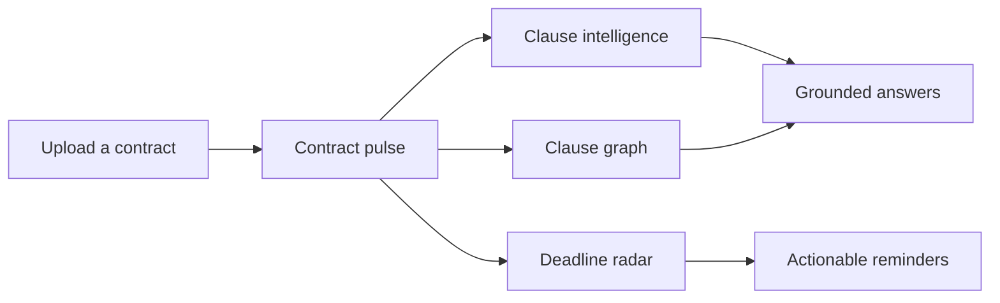

# LegalLens

> Turn dense contracts into decision-ready intelligence.

LegalLens is a contract intelligence workspace built for quickly understanding agreements, spotting risk, tracing clause relationships, and staying ahead of important deadlines. The current interface is a polished frontend prototype with realistic contract-analysis data and interactive workspace flows.

## Highlights

- **Contract pulse:** See exposure, fairness, financial impact, and upcoming obligations at a glance.
- **Clause intelligence:** Search clauses by title, category, or risk level and read plain-language interpretations.
- **Clause graph:** Explore direct and inferred relationships between clauses, obligations, and penalties.
- **Deadline radar:** Track notice windows, renewal decisions, and deposit-return tasks.
- **Grounded copilot:** Ask questions about a contract and receive answers with clause and page citations.
- **Privacy-first UX:** The interface communicates session-scoped document handling and automatic expiry.
- **Responsive workspace:** Designed for a focused desktop workflow with responsive layouts for smaller screens.

## Product Tour



## Tech Stack

| Layer            | Technology                            |
| ---------------- | ------------------------------------- |
| UI               | React 19, TypeScript                  |
| Build tool       | Vite 7                                |
| Styling          | Tailwind CSS 4 and custom CSS         |
| UI primitives    | Radix UI                              |
| Icons            | Lucide React                          |
| Routing          | Wouter-compatible navigation patterns |
| Server           | Express and Node.js                   |
| Package managers | npm or pnpm                           |

## Project Structure

```text
.
├── frontend/
│   ├── client/
│   │   ├── src/
│   │   │   ├── components/   # Shared UI and map components
│   │   │   ├── pages/        # Overview, intelligence, graph, reminders, settings
│   │   │   └── App.tsx       # Workspace shell and navigation
│   │   └── public/            # Static browser assets
│   ├── server/                # Express production server
│   ├── package.json
│   ├── vite.config.ts
│   └── tsconfig.json
│   └── patches/               # Package patches used by pnpm
└── README.md
```

## Getting Started

### Requirements

- Node.js 20 or newer
- npm 10+ or pnpm 10+

### Install

From the repository root:

```bash
cd frontend
npm install
```

The repository also includes a pnpm lockfile. When using pnpm, run:

```bash
cd frontend
pnpm install
```

### Run locally

```bash
npm run dev
```

Open [http://localhost:3000](http://localhost:3000). Vite will choose the next available port if port `3000` is already in use.

### Production build

```bash
npm run build
npm run start
```

The client build is written to `frontend/dist/public`, and the bundled Express server is written to `frontend/dist/index.js`.

## Useful Commands

| Command           | Purpose                                            |
| ----------------- | -------------------------------------------------- |
| `npm run dev`     | Start the Vite development server                  |
| `npm run build`   | Build the client and production server             |
| `npm run start`   | Serve the production build                         |
| `npm run preview` | Preview the Vite build locally                     |
| `npm run check`   | Run the TypeScript compiler without emitting files |
| `npm run format`  | Format the project with Prettier                   |

## Current Scope

This version is a frontend-first prototype. The interface contains representative contract data and interaction states, while these integrations are reserved for the backend phase:

- Document upload and parsing at `/api/documents/analyze`
- Persistent document and workspace storage
- Production search across uploaded documents
- Report sharing and CSV export
- Voice input and speech playback integration
- Connected reminder delivery

The UI is intentionally structured around those future boundaries so backend services can be added without redesigning the core workspace.

## Version Control Workflow

Keep changes easy to review and release:

1. Create a focused branch from `main`:

   ```bash
   git switch -c feat/short-description
   ```

2. Make one logical change at a time and run the checks:

   ```bash
   cd frontend
   npm run check
   npm run build
   ```

3. Review the staged diff before committing:

   ```bash
   git diff --check
   git diff --staged
   ```

4. Use a concise Conventional Commit message:

   ```bash
   git add .
   git commit -m "feat: add clause risk filters"
   git push -u origin feat/short-description
   ```

Suggested commit prefixes are `feat`, `fix`, `docs`, `refactor`, `test`, `build`, and `chore`.

## Contributing

Pull requests should explain the user-facing change, include screenshots for visual updates, and mention the validation commands that were run. Keep secrets, uploaded documents, generated build output, and local environment files out of commits.

Before opening a pull request, confirm:

- TypeScript checks pass.
- The production build succeeds.
- New UI works at desktop and mobile widths.
- Navigation and interactive states remain keyboard-accessible.
- Documentation reflects any new command, route, or integration.

## Privacy Note

Legal documents can contain sensitive information. Do not use real contracts in development or screenshots. Replace names, addresses, account numbers, signatures, and other identifying information with fictional data.

## License

This project is licensed under the MIT License. See the `license` field in `frontend/package.json` for the project metadata.
